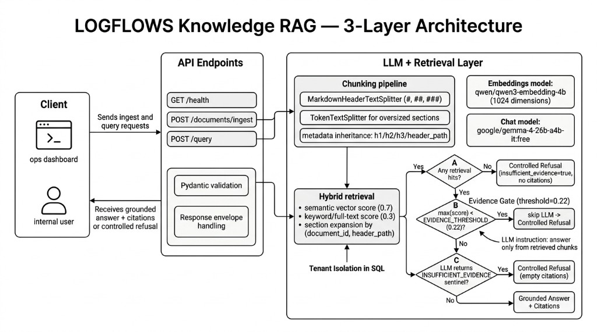

# LOGFLOWS Knowledge RAG

RAG backend for logistics documents (SOPs, policies, incidents, customer notes). **FastAPI** + **Postgres/pgvector** hybrid search (0.5 cosine + 0.5 `ts_rank_cd`) + **OpenRouter** (Qwen embeddings, DeepSeek R1 chat). Indexed docs only — live TMS/LMS data is out of scope.

**Routes:** `GET /health`, `POST /documents/ingest`, `POST /query`  
**Flow:** ingest/query → hybrid retrieve → evidence gate (floor + elbow) → LLM or refusal → answer + citations



## Quickstart (Docker)

**Prerequisites:** Docker Compose v2, [uv](https://docs.astral.sh/uv/) (optional for host dev), [OpenRouter key](https://openrouter.ai/keys)

```bash
git clone https://github.com/FelixManFongCheung/logflow-interview.git
cd logflows-interview
cp .env.example .env.development   # set OPENROUTER_API_KEY
make start && make seed-docker     # api + db; 6 docs → tenant logflows-demo
```

Swagger: [http://localhost:8000/docs](http://localhost:8000/docs). Postgres loads `sql/schema.sql` on first boot; API re-applies it idempotently via `init_db()`.

**Host dev (optional):** `make install && make db && make dev && make seed` with `POSTGRES_HOST=localhost`.

## Environment

Loads from `.env.development` → `.env` → `.env.example`.

| Variable | Required | Default |
|----------|----------|---------|
| `OPENROUTER_API_KEY` | **Yes** | — |
| `EMBEDDING_MODEL` / `EMBEDDING_DIMENSIONS` | No | `qwen/qwen3-embedding-4b` / `1024` |
| `LLM_MODEL` | No | `deepseek/deepseek-r1-0528` |
| `CHUNK_SIZE_TOKENS` / `CHUNK_OVERLAP_TOKENS` | No | `256` / `32` |
| `RETRIEVE_POOL_K` / `RETRIEVE_K` | No | `20` pool / `6` kept after elbow |
| `HYBRID_*_WEIGHT` | No | `0.5` / `0.5` |
| `EVIDENCE_THRESHOLD` / `HIGH_CONFIDENCE_THRESHOLD` | No | `0.22` / `0.45` |
| `USE_ELBOW_GATE` / `ELBOW_MIN_GAP` / `ELBOW_MIN_RELATIVE_GAP` | No | `true` / `0.08` / `0.15` |
| `POSTGRES_*` | No | See `.env.example`; Compose sets `POSTGRES_HOST=db` |

## API

Responses: `{ "success": true, "message": "...", "data": { ... } }` or `{ "success": false, "error_code": "...", ... }`.

**Ingest** — chunk, embed, upsert; re-ingest replaces chunks for same `document_id`.

```json
{ "tenant_id": "logflows-demo", "documents": [{ "id": "sop-001", "title": "Cold Chain SOP", "text": "# ...", "visibility": "all" }] }
```

`visibility`: `ops` | `cs` | `all` — filtered by caller `role` at retrieval.

**Query**

```json
{ "tenant_id": "logflows-demo", "user_id": "ops-user-01", "role": "ops", "question": "What should we do if a cold-chain delivery is delayed?" }
```

Returns `answer`, `citations[]`, `confidence` (`high`|`medium`|`low`), `insufficient_evidence`. Citations include `document_id`, `chunk_id`, `score`, `title`, `header_path` — not chunk body text.

## Sample data & expected behaviour

`make seed-docker` loads six markdown files from `data/samples/` (~**47 chunks**):

| ID | Title | Visibility |
|----|-------|------------|
| `sop-001` | Cold Chain SOP | `all` |
| `wh-esc-002` | Warehouse Escalation Procedure | `ops` |
| `cust-acme-003` | Customer Handling Notes — ACME Retail | `all` |
| `inc-2026-014` | Incident Report INC-2026-014 | `ops` |
| `pol-haz-005` | Hazardous goods labeling | `all` |
| `sop-006` | Inbound Receiving SOP | `all` |

| Question | Expected |
|----------|----------|
| Cold-chain delivery delayed? | **Answerable** — cites `sop-001` delay procedure |
| What happened on shipment SH-8891 to Berlin? | **Partial** — `inc-2026-014`; gaps noted or refusal |
| ACME freight rate to Hamburg? | **Not answerable** — `insufficient_evidence=true` (rates excluded in docs) |

**Verify:**

```bash
curl -sS -X POST localhost:8000/query -H "Content-Type: application/json" \
  -d '{"tenant_id":"logflows-demo","user_id":"ops-user-01","role":"ops","question":"What should we do if a cold-chain delivery is delayed?"}' | jq .
make test   # mocked retrieval/LLM
```

## Key decisions

**Chunking** — Markdown split on `#`/`##`/`###`; sections >256 tokens split again (32 overlap). Chunks carry `header_path` for section expansion.

**Embeddings** — `qwen/qwen3-embedding-4b` @ 1024 dims via OpenRouter; matches `vector(1024)` in schema. Re-ingest if model changes.

**Chat** — `deepseek/deepseek-r1-0528` interprets retrieved blocks (cross-doc nuance, partial coverage); retrieval is not replaced by reasoning.

**Vector store (pgvector)** — One ACID Postgres for text, FTS, metadata, and vectors; tenant/role filters + hybrid fusion + section expansion in one SQL function (`hybrid_search()`). HNSW suffices at ~47 chunks; async `psycopg`; LangChain only for chunking splitters. Chose pgvector over Pinecone/Qdrant to avoid dual-write at this scale; same schema on Compose or hosted Postgres.

**Hybrid + citations** — 0.5 cosine + 0.5 `ts_rank_cd` (procedural SOPs). `is_primary_hit` splits API citations from LLM-only section siblings.

**Evidence gate** — Fused score = `0.5×cosine + 0.5×ts_rank_cd` (not raw cosine). (1) **Floor:** refuse before LLM if `max(primary score) < 0.22`. (2) **Elbow:** on up to `RETRIEVE_POOL_K=20` primaries (often fewer on small corpus), find the **largest** consecutive score drop; it must pass **both** `ELBOW_MIN_GAP=0.08` and **15% of top score**, else elbow is off and only the floor applies. When active, drop primaries below cliff edge; cap at `RETRIEVE_K=6`. Example cliff: 0.88/0.85/0.81/0.45 → keep top three. Example no-elbow: cold-chain delay query 0.5633→0.4832 (gap 0.0801 OK, but 14.2% relative < 15%) → six citations kept above 0.22.

**Confidence** (retrieval-only, on kept primaries): `low` = refusal or below floor; `medium` = ≥0.22; `high` = ≥0.45 **and** ≥2 kept hits. Post-LLM `INSUFFICIENT_EVIDENCE` clears citations.

**Not implemented:** reranking, query rewriting, streaming. **Production path:** RRF in SQL (rank merge, ~0.01–0.02 scores) → retrieve 25–50 → cross-encoder rerank → gate on rerank scores; recalibrate or replace today's 0.22/elbow constants.

## Production considerations

**Tenancy** — SQL filters `tenant_id` + `visibility`/`role`; not auth. Production: JWT sets tenant/role server-side; consider Postgres RLS.

**Docs** — Re-ingest replaces per `document_id` (transactional). No delete API; embedding model change = full re-ingest.

**Observability / cost / latency** — Today: `/health` only. Add request IDs, stage traces, refusal metrics. Cost: embed on ingest, R1 on gated queries; floor + elbow skip weak calls. Answered query ~3–20 s (LLM-bound); refusal ~0.2–1 s. Target p95 answer <8 s with streaming or cheaper model.

**Security / scale** — Questions + doc text go to OpenRouter. Lock CORS, use `POSTGRES_SSLMODE=require` hosted, rate-limit `/query`. At ~1M chunks: Postgres + RLS, RRF + rerank, tenant indexes; second vector DB only if Postgres becomes the bottleneck.

## Known limitations

- No JWT — `tenant_id`/`role` trusted from body; SQL isolation only
- Markdown-first ingest; no PDF/OCR; chunking needs headings for `header_path`
- No query rewrite, rerank, eval loop, HITL, streaming, or delete endpoint
- Thresholds/elbow are env-tuned, not self-calibrating; hybrid weights shift score distributions
- Citations lack chunk body; `english` FTS config; live TMS data out of scope

## Ops

| Target | Action |
|--------|--------|
| `make start` | API + Postgres (Docker) |
| `make seed-docker` | Ingest samples in container |
| `make dev` / `make db` | Host API / DB only |
| `make test` | pytest (no live LLM) |
| `make stop` | `docker compose down -v` (wipes DB volume) |

**Docker macOS:** if `docker-credential-desktop` missing, Makefile prepends Docker.app to PATH, or `export PATH="/Applications/Docker.app/Contents/Resources/bin:$PATH"`.
